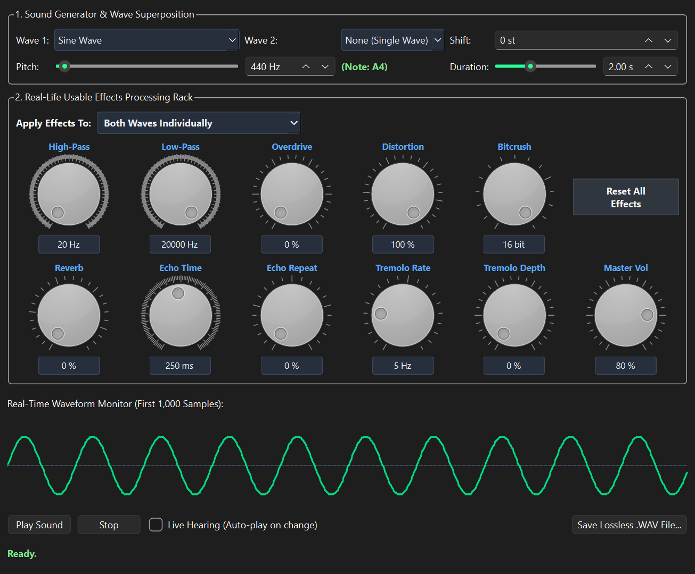
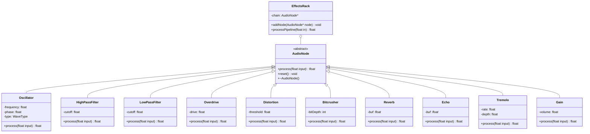

# Digital Audio Synthesizer

> A modular software synthesizer, wave superposition lab, and multi-effects digital signal processing (DSP) studio implemented in modern C++ and Qt.



---

## Overview

**Digital Audio Synthesizer** is an educational and functional digital audio workstation (DAW) synthesizer built from scratch without external audio engines. It demonstrates fundamental and advanced **Object-Oriented Programming (OOP)** principles alongside real-world acoustics, wave physics, and digital signal processing.

The application features dual-oscillator wave superposition, a full 20 Hz to 20,000 Hz human hearing pitch spectrum, 10 real-world audio effects with synchronized editable numeric controls, individual wave effect routing, real-time waveform visualization, and studio-quality lossless 16-bit PCM WAV export.

---

## Features

### 1. Sound Generator & Wave Superposition
- **6 Classical Waveforms**: Sine, Square, Sawtooth, Triangle, Pulse (25% Duty Cycle), and White Noise.
- **Wave Superposition (Dual Oscillator)**: Superimpose a secondary wave over the primary wave based on the physical Principle of Superposition:
  $$y(t) = \frac{y_1(t) + y_2(t)}{2}$$
- **Harmonic Semitone Shift**: Pitch-shift the secondary wave from `-24` to `+24` semitones (`st`) for unisons, musical fifths, or dual-octave chords.
- **Full Human Hearing Range**: Smoothly sweep frequencies across the complete human hearing spectrum (**20 Hz to 20,000 Hz**) with synchronized numeric input.
- **Automatic Musical Note Detection**: Displays musical pitches in real time (e.g., `Note: A4`, `Note: C1`, `Sub-bass`, `High Treble`).
- **Configurable Sound Duration**: Set audio duration from `0.5 s` to `5.0 s`.

### 2. Multi-Effects Processing Rack (10 Usable Effects)
Every effect dial features an **editable numeric box directly at its bottom** for precise input:

| Effect | Parameter Range | Description |
| :--- | :--- | :--- |
| **High-Pass Filter** | `20 Hz – 2000 Hz` | Low-cut filter that removes muddy sub-bass rumble. |
| **Low-Pass Filter** | `200 Hz – 20,000 Hz` | High-cut filter that smooths harsh frequencies into warm tones. |
| **Tube Overdrive** | `0% – 100%` | Cubic soft-clipping saturation ($x - \frac{x^3}{3}$) for warm analog tube warmth. |
| **Distortion** | `5% – 100%` | Hard-clipping fuzz for aggressive, crunchy tones. |
| **Bitcrusher** | `2 – 16 bit` | Discrete sample quantization for retro 8-bit arcade timbres. |
| **Room Reverb** | `0% – 90%` | Multi-tap reflection network (25ms, 47ms, 75ms) simulating room acoustics. |
| **Echo Delay Time**| `20 ms – 500 ms` | Circular delay buffer timing. |
| **Echo Repeats** | `0% – 80%` | Feedback regeneration percentage. |
| **Tremolo Rate** | `1 Hz – 20 Hz` | Low-Frequency Oscillator (LFO) pulsation speed. |
| **Tremolo Depth**| `0% – 100%` | Amplitude modulation intensity. |
| **Master Volume** | `0% – 100%` | Output gain scaling. |

### 3. Individual Wave Effects Routing
Choose how the DSP rack processes superimposed waves:
- **Both Waves Individually**: Each wave passes through its own independent processing pipeline before superposition, eliminating intermodulation distortion.
- **Wave 1 Only (Wave 2 Clean)**: Applies effects exclusively to Wave 1 while preserving Wave 2 as a pure, dry anchor (e.g., distorted lead + clean sub-bass).
- **Wave 2 Only (Wave 1 Clean)**: Applies effects exclusively to Wave 2 while keeping Wave 1 dry (e.g., clean lead + ambient reverb wash).
- **Both Waves Combined**: Sums both waves first, then routes the combined signal through the master effects rack.

### 4. Monitoring, Playback & Lossless Export
- **Real-Time Waveform Monitor**: Oscilloscope display showing the synthesized waveform geometry.
- **Live Hearing**: Instant background audio preview with dedicated `Play Sound`, `Stop`, and an `Auto-play on change` live mode.
- **Lossless .WAV Export**: Generates standard uncompressed 16-bit Linear PCM audio files at 44.1 kHz with smooth 20ms anti-pop envelopes.

---

## OOP Architecture & Concepts

The project is structured according to fundamental OOP requirements:



- **Encapsulation**: Strict private member variables with public interfaces.
- **Inheritance & Abstract Base Classes**: `AudioNode` defines a pure virtual `process(float)` interface.
- **Runtime Polymorphism**: `EffectsRack` manages an array of base-class pointers (`AudioNode**`) and executes dynamic binding at runtime.
- **Dynamic Memory Management**: Raw pointers with `new[]` and `delete[]` manage circular delay lines (`Echo`, `Reverb`) and audio buffers.
- **Binary File Handling**: `WavWriter` uses `std::ofstream` in binary mode to write standard 44-byte RIFF headers and PCM samples.

---

## Project Structure

```text
Basic-Audio-Synthesizer/
├── CMakeLists.txt          # CMake project configuration
├── main.cpp                # Application entry point
├── MainWindow.h            # Main UI declaration
├── MainWindow.cpp          # UI layout, event routing, dual DSP pipelines
├── AudioEngine.h           # DSP nodes, effects, and WAV file writer
├── WaveformDisplay.h       # Waveform visualizer widget
├── run.bat                 # One-click Windows launch script
├── assets/
│   └── ui_screenshot.png   # Application interface preview
└── LICENSE                 # Project license
```

---

## How to Run & Build

### Option 1: One-Click Launcher (Windows)
Double-click **`run.bat`** in the project folder. It automatically locates the MinGW compiler and Qt 6 libraries, builds the project if needed, and launches the application.

### Option 2: From Command Line / PowerShell
```powershell
# 1. Set environment paths for Qt 6 and MinGW
$env:PATH = "C:\Qt\6.11.2\mingw_64\bin;C:\Qt\Tools\mingw1310_64\bin;C:\Qt\Tools\CMake_64\bin;C:\Qt\Tools\Ninja;" + $env:PATH

# 2. Build the project
cmake -B "build\Desktop_Qt_6_11_2_MinGW_64_bit_Debug" -G "Ninja" -DCMAKE_BUILD_TYPE=Debug -DCMAKE_PREFIX_PATH="C:\Qt\6.11.2\mingw_64"
cmake --build "build\Desktop_Qt_6_11_2_MinGW_64_bit_Debug"

# 3. Launch executable
.\build\Desktop_Qt_6_11_2_MinGW_64_bit_Debug\DigitalAudioSynthesizer.exe
```

### Option 3: Using Qt Creator
1. Open **Qt Creator**.
2. Select **File → Open File or Project...** and choose `Basic-Audio-Synthesizer/CMakeLists.txt`.
3. Select your Qt 6 MinGW kit and press **Run** (`Ctrl + R`).

---

## Technical Specifications

- **Language**: C++17
- **GUI Framework**: Qt 6 (Widgets)
- **Audio Output**: 16-bit Linear PCM Mono, 44.1 kHz (CD Quality)
- **Audio Playback Backend**: Windows Multimedia API (`winmm`)
- **File Format**: Standard RIFF WAVE (`.wav`)

---

## License

This project is licensed under the terms of the [LICENSE](LICENSE) file.
